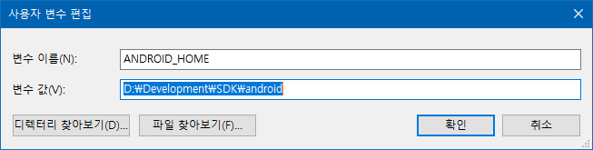
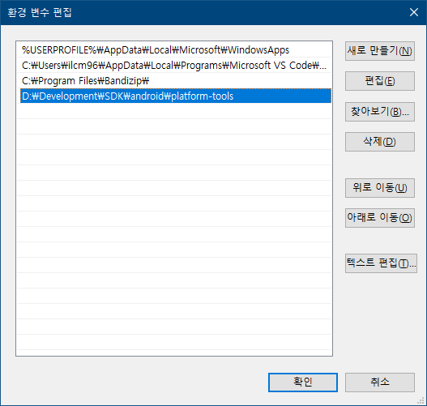
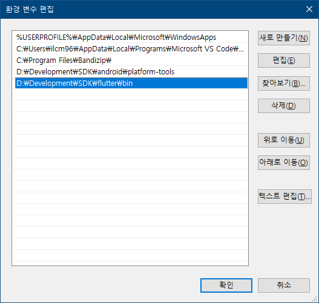
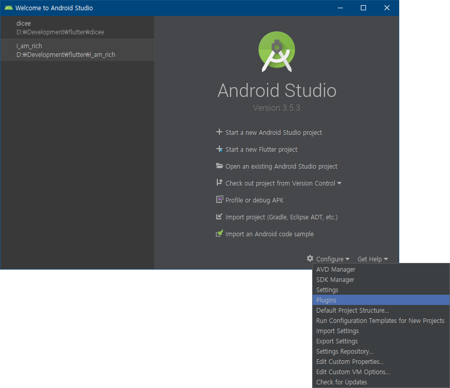
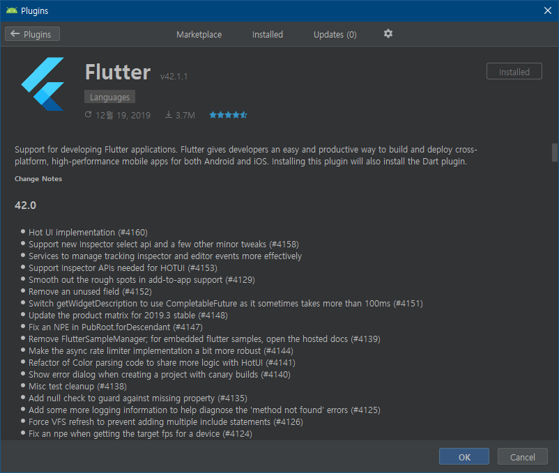
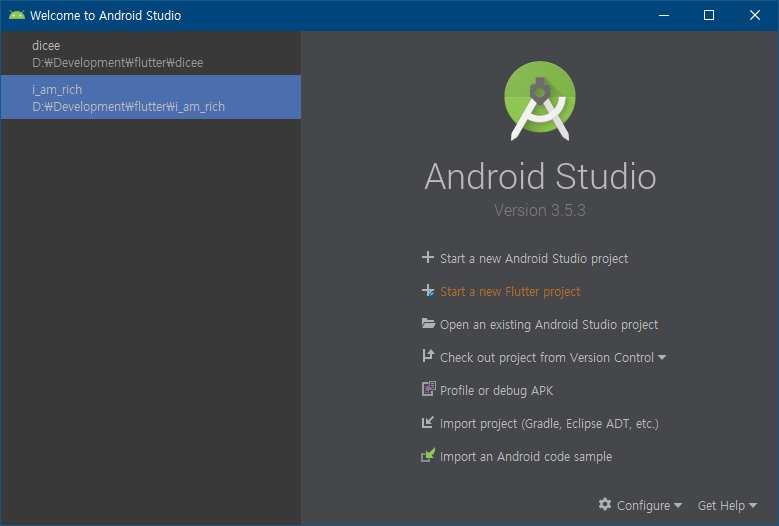

> Windows 10에서 진행합니다

# Flutter란?

Flutter는 Google에서 개발한 크로스 플랫폼 앱 개발 프레임워크이다. 현재는 주로 모바일 환경에서 사용되고 있고 웹과 데스크톱 앱도 개발할 수 있게 현재 개발이 진행되고 있다.

# Flutter가 최초의 크로스 플랫폼 앱 개발 프레임워크인가?

물론 Flutter가 나오기 전에도 한 가지 코드 베이스로 여러 기기에서 작동하는 앱을 만들기 위한 시도는 있었다.

그중 처음은 Webview를 활용한 앱(Web APP)이다. 먼저 HTML, CSS, JS로 웹페이지를 만들고 각 플랫폼의 Webview를 활용하는 앱이다. 다만 카메라, 위치, 오디오등의 기기의 네이티브 요소를 활용하는 앱을 만들기 어려웠다.

그다음으로는 2015년 혜성처럼 등장한 React Native(RN)가 있다. 2015년 이전에도 웹 개발에서 쓰이던 React는 RN이 출시할 당시에도 인기 있는 프레임워크였고 앱을 제작하고 싶은 많은 웹 개발자들이 RN으로 앱 개발에 입문하게 된다.
다만 RN는 Native, 즉 브라우저가 아닌 네이티브 환경(Android, iOS)에서 돌아긴 했지만 완벽한 네이티브 앱은 아니다. 따라서 카메라, 오디오등 기기의 HW와 밀접한 관련이 있는 코드를 작성하기 위해서는 bridge를 거쳐야만 했고, 이는 RN으로 개발한 앱의 성능을 떨어뜨리는 원인이 되었다.

# RN이 성능이 떨어지면 Flutter는 그렇지 않은가?

RN과 다르게 Flutter는 RN의 성능 하락 주범인 bridge가 없고, Dart로 작성한 코드를 AOT 컴파일을 통해 Native단에서 돌아가는 코드로 변환된다. 또한 Skia 라이브러리를 사용해 위젯을 직접 그리기에 대부분의 상황에서 60 FPS를 보장한다.

## 개발환경 구축에 앞서...

Flutter를 개발하기 위한 공식 툴을 2가지가 있는데, 첫 번째는 **VS Code**이고 두 번째는 **Android Studio**이다. 앱을 실제로 퍼블리싱할 때 쓰이는 몇몇 도구가 Android Studio에 있고 Android SDK를 손쉽게 설치할 수 있기 때문에 필자는 Android Studio를 권장한다.

자 그럼 본격적으로 Flutter 개발환경을 구축해 보자.

# 1. Android Studio 설치

[Android Studio 공식 홈페이지](https://developer.android.com/studio)에 가서 다운로드하고 설치하면 된다. 설치 과정에서 나오는 Android SDK의 위치를 잘 기억해두자.

# 2. 환경변수 설정

아까 기억해둔 Android SDK의 위치를 환경변수를 설정하는 곳에 가서 사용자 변수 항목에 변수 이름은 `ANDROID_HOME`을 변수 값은 Android SDK의 위치를 넣고 등록하면 된다.

그다음에는 Android SDK 폴더 아래에 위치해 있는 **platform-tools** 폴더를 등록해야 한다.
시스템 변수 항목에 **Path**라는 항목을 클릭해서 **platform-tools** 폴더의 위치를 입력하고 저장한다.

# 3. Flutter SDK 다운로드

[Flutter SDK Page](https://flutter.dev/docs/development/tools/sdk/releases?tab=windows)에 가서 Stable 채널에서 가장 최신 버전의 SDK를 다운로드 하고 원하는 위치에 압축을 푼다.
필자는 Android SDK와 함께 Flutter SDK를 **D:\Development\SDK** 아래에 위치시켜 놓는다.

# 4. Flutter SDK 환경 변수에 등록

아까 **platform-tools** 폴더를 **Path**에 등록했던 것처럼 똑같이 등록하면 되는데, 이때 SDK의 루트 폴더가 아니라 그 아래에 **bin** 폴더를 등록해야 한다.

# 5. Flutter Plugin 설치

처음 설치한 Android Studio를 열고 **Plugins**를 연다.

**Flutter**를 검색하고 설치하면 된다.

Install를 누르면 Dart 플러그인도 같이 설치하냐고 묻는데 Flutter는 Dart 기반이므로 같이 설치해야 한다.

# 6. Flutter 프로젝트 시작

Plugins 항목을 닫고 메인화면으로 돌아온뒤 **Start a new Flutter project**를 눌러 Flutter의 세계로 진입하면 된다 :)

# 마치며...

사실 Google은 [Killed by Google](https://killedbygoogle.com/)이란 사이트가 있을 정도로 많은 서비스를 출시하고 금방 서비스를 종료하는 회사중 하나이다. 따라서 1년 전만 해도 Flutter는 과거 구글의 행보때문에 아직은 시작하기 부담스러운 프레임워크였다.

그러나 지금은 [Tencent](https://youtu.be/DVGIBU109nI), [New York Times](https://www.nytimes.com/games/prototype/kenken#/)등 여러 회사와 Google AD, [Stadia](https://9to5google.com/2019/11/08/google-stadia-app-play-store-download/), [Smart Display platform](https://developers.googleblog.com/2019/05/Flutter-io19.html)에 들어가는 일부 기능 등 자사의 서비스에도 적용하는 것을 보면 Flutter가 아직 RN에 비해 부족한 기능(~~웹뷰라던가 웹뷰라던가 웹뷰라던가~~) 때문에 선택을 안 할지언정 Flutter의 개발 종료로 인해 Flutter를 선택하지 않을 이유는 없는 것 같다.
