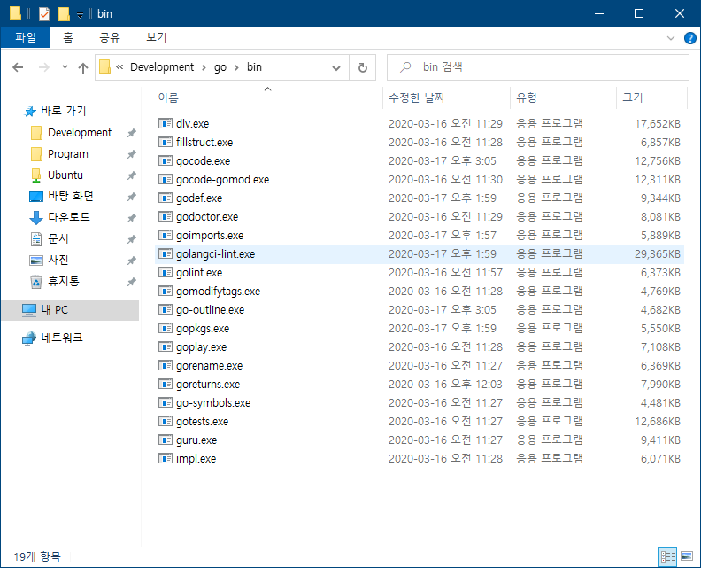
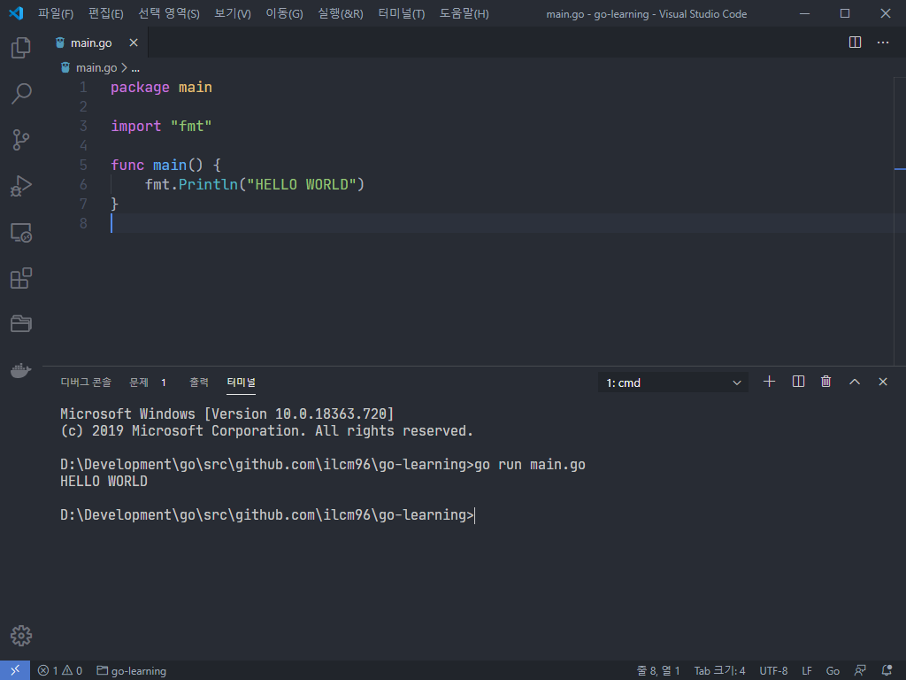

# Requirement

- VSCode
- 기본적인 윈도우 환경 변수 설정 방법

# 1. Go 다운로드

[공식 홈페이지](https://golang.org/dl/#featured)에 가서 `go*.windows-amd64.msi`라고 적힌 것을 다운로드 하고 설치한다.
설치 위치는 기본 위치인 `C:\Go`에 하면 된다.

# 2. 개발할 폴더 정하기

Go는 Python이나 JS처럼 아무 폴더나 만들어서 그 안에서 개발하는 방식이 아니다.  
`GOPATH`로 지정된 폴더 안에 `bin`, `pkg`, `src` 폴더를 만들고 src 폴더 안에서 개발하는 방식이다.

1. 먼저 개발할 폴더를 정한다 (필자는 `D:\Development\go`라는 폴더를 만들었다)
2. 그 폴더 안에 `bin`, `pkg`, `src` 폴더를 만든다.
3. 코드를 Github와 같은 버전 관리 시스템에 푸시할 생각이 있다면 `src/gitub.com/userName/repoName`와 같은 형태로 폴더를 만든다.

```
go
├── bin
├── pkg
└── src
    └── github.com
        └── ilcm96
            └── go-learning
```

4. 코드를 푸시할 생각이 없다면 `src/someFolder`의 형태로 만든다.

```
go
├── bin
├── pkg
└── src
    └── go-learning
```

> **Tip)** bin, pkg, src를 포함하는 폴더(go)를 백신에 예외처리 하는게 좋다 (아직 유저가 적어서 그런지 오진이 많다)

# 3. 환경 변수 설정

윈도우의 사용자가 여려 명이고 각자 다른 역할을 수행한다면 `사용자명`에 대한 환경변수에 한 명이라면 사용자 변수나 시스템 변수중 아무 곳에나 설정해도 무방하다.

1. 먼저 PATH에 `C:\Go\bin`를 추가한다.
2. `GOROOT` 항목을 추가하고 변수 값으로는 `C:\Go`를 입력한다.
3. `GOPATH` 항목은 위에서 정한 `bin`, `pkg`, `src`가 있는 폴더를 설정하면 된다.

다 설정하고 나서 CMD를 열고 `go version`을 입력해서 버전이 정상적으로 출력된다면 잘 설정된 것이다.

```
C:\Users\ilcm96>go version
go version go1.14 windows/amd64
```

# 4. VSCode 설정

1. Go 확장을 설치한다.  
   
2. `main.go`를 만들고 입력을 시작하면 우측 하단에 여러 툴을 설치하라는 메세지가 나오는데 이때 **Install All**을 눌러서 다 설치하면 된다.  
   설치한 후 `bin` 폴더를 보면 설치한 툴의 exe 파일이 있는것을 볼 수 있다.
   

# 5. 코드 실행

코드 실행은 터미널을 열고 `go run main.go` 등으로 실행하면 된다.  
다만 `run` 명령어를 사용하게 되면 빌드된 바이너리가 임시폴더에 생기기 때문에 웹개발시 방화벽 관련 창이 계속 뜬다.  
따라서 웹개발을 하는 경우 `run.cmd`등의 파일을 만들고 아래 내용을 붙여넣어서 사용하는 것이 좋다.

```
go build -o main main.go && main.exe
```


